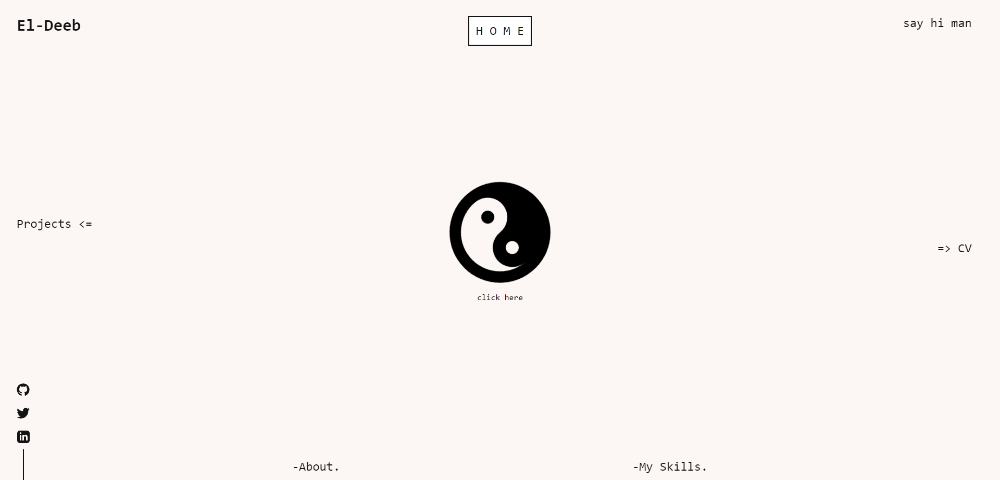

# Protfolio

> #### A Protfolio web site.

## Built With

- React.js
- CSS

## Additional Used

- Gitflow
- npm

## Getting Started

To get a local copy up and running follow these simple example steps.

`git clone https://github.com/eng-mohamed-eldeeb/protfolio-v2.0.git`

Then `cd protfolio-v2.0`

Then `npm install` to install packages

Finally `npm start`

## Authors

👤 **Mohamed Eldeeb**

- GitHub: [@eng-mohamed-eldeeb](https://github.com/eng-mohamed-eldeeb)
- LinkedIn: [LinkedIn](https://www.linkedin.com/in/eng-mohamed-eldeeb/)

## 🤝 Contributing

Contributions, issues, and feature requests are welcome!

Feel free to check the [issues page](../../issues/).

## Live Demo

- [live demo to see the Covid Stats](https://protfolio-v2-0.vercel.app/)

## Site Screenshots

## Show your support

Give a ⭐️ if you like this project!

## 📝 License

This project is [MIT](./MIT.md) licensed.